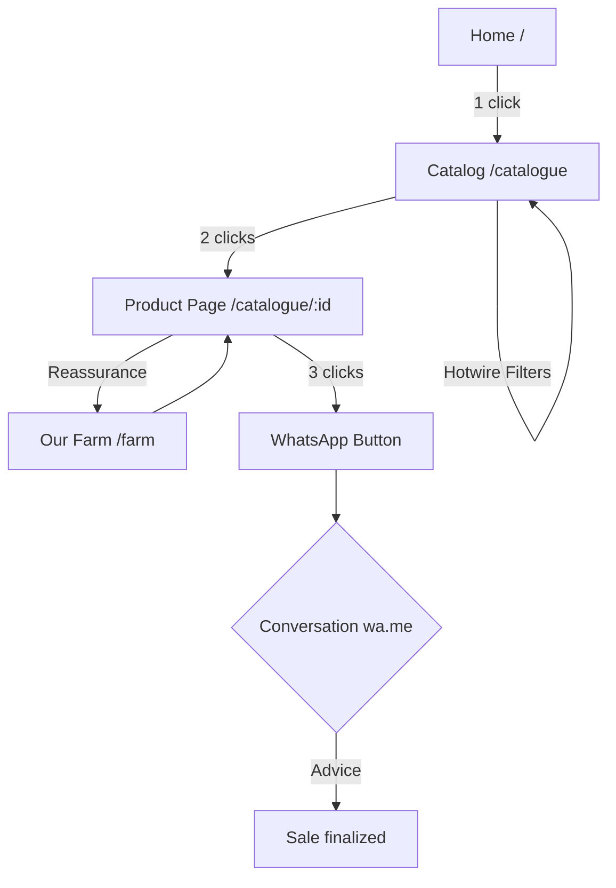
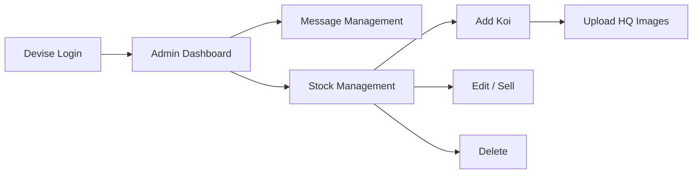
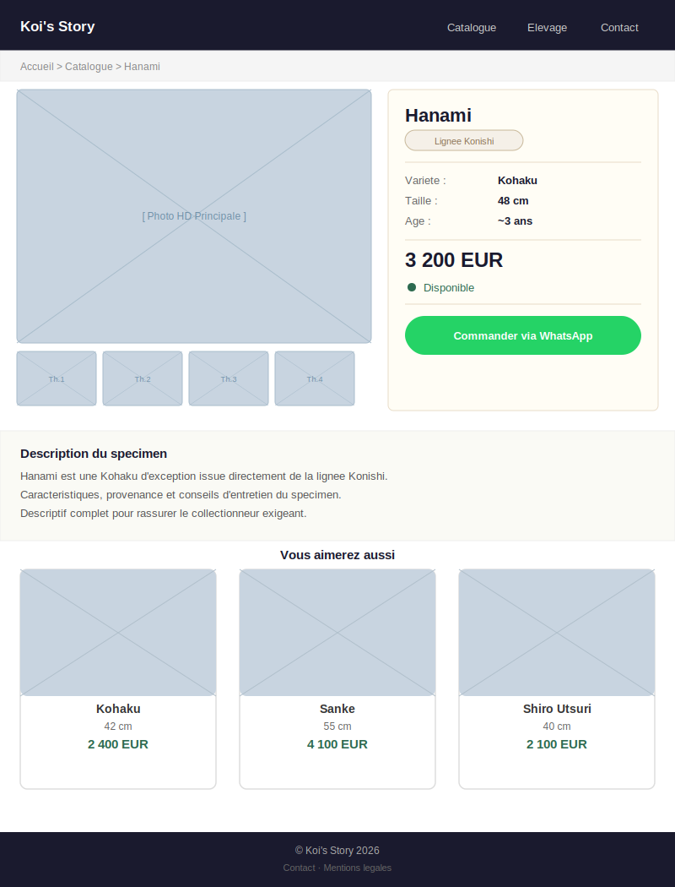

  

  

    
    
    
    
    
  

  

    
    
    
    
    
    
    
  

  

    <i>Digital showcase platform for a koi carp breeding farm affiliated with the Konishi lineage.</i> 
    Final project  <a href="https://www.thehackingproject.org">The Hacking Project</a> 
   Trello Board  <a href="https://trello.com/b/u2kahNMY/kois-story">Koi's Story Trello</a>
  

---

## About

**Koi's Story** is a digital showcase platform for browsing and ordering koi carp from the Konishi lineage. Visitors can explore the catalog, filter by variety, size or price, and contact the seller directly via WhatsApp in one click.

**Key features**

- Filterable catalog (variety / size / price)
- Product page with photo gallery and Konishi Lineage badge
- Pre-filled "Order via WhatsApp" button
- Photo & video gallery of the breeding farm
- Contact form with email notification
- Admin back-office (koi CRUD, message management)

## Repository Status

This repository is currently in the planning and documentation phase.

The Rails application has not been scaffolded yet. At this stage, the repository contains:

- product framing
- UX documentation
- design references
- delivery planning
- collaboration standards

## Planned Setup

Once implementation starts, the project is expected to use:

- Ruby on Rails
- SQLite
- Hotwire
- Devise
- Cloudinary
- ActionMailer
- Atomic Design for UI composition

## Environment

An example configuration file is available at `.env.example`.

## Working Standards

- `Main` is the production branch
- `DEV` is the integration branch
- contributor branches are `Morgan`, `Romain`, and `Valentin`; **Cursor**, **Claude**, and **Gemini** are acknowledged as tooling contributors in `CONTRIBUTORS.md`
- all code and `README.md` content must stay in English
- routes must remain RESTful
- business logic belongs in models
- UI components should follow Atomic Design

## Repository Documents

- `docs/README.md` for the documentation index
- `docs/todo.md` for execution tracking
- `docs/roadmap.md` for milestones
- `docs/stack.md` for the planned stack
- `CONTRIBUTING.md` for collaboration rules
- `CONTRIBUTORS.md` for the contribution log
- `SECURITY.md` for vulnerability reporting

## Executive Summary

### Presentation
Koi's Story is a premium digital showcase dedicated to the breeding and sale of exceptional koi carp. Led by Mathilde and Emmanuel, this farm stands out for its exclusive affiliation with the prestigious Konishi lineage. The project aims to transform a market traditionally based on word-of-mouth into a modern and immersive digital experience, matching the nobility of these specimens.

### Business Model
The model is based on the sale of high-quality specimens. The platform facilitates conversion by allowing collectors to browse a filterable catalog (variety, size, price) and initiate the purchase through a direct connection via WhatsApp. This channel favors personalized advice and secure transactions for high-value products, bypassing automated payment tunnels.

### Our Clients
Our clients are koi carp enthusiasts, ranging from beginners to seasoned collectors. They seek exclusivity, traceability, and the aesthetic quality guaranteed by the Konishi lineage. This demanding audience prefers mobile consultation and direct contact with the breeder.

### Vision
In 3 years, Koi's Story aims to become the essential digital reference for acquiring Konishi koi carp in France. We aim to consolidate our online presence and continuously optimize the user experience to solidify our position as a leader in this premium niche segment.

## User Journey

### 1. Visitor Journey (Buyer)
The goal is to allow the user to find a fish and contact the seller in **less than 3 clicks**.

*   **Step 1: Discovery & Home (/)**: Arrival on an immersive landing page (visual hero of a pond).
*   **Step 2: Catalog Exploration (/catalogue)**: Browsing product cards with dynamic filtering (Hotwire) by variety, size, and price.
*   **Step 3: Product Detail View (/catalogue/:id)**: Examining HD photos and technical characteristics (size, estimated age, description).
*   **Step 4: Contact (WhatsApp)**: One-click "Order via WhatsApp" button opening a pre-filled message with koi reference.

### 2. Administrator Journey (Manager)
The goal is to provide a simplified interface for daily stock and contact management.

*   **Step 1: Authentication (/users/sign_in)**: Secure access via Devise for administrators only.
*   **Step 2: Dashboard**: Overview of received messages via the contact form and quick stock statistics.
*   **Step 3: Stock Management (CRUD)**: Creating new listings (name, variety, price, size, Konishi badge), uploading photos (Cloudinary), and updating status (Available/Sold).
*   **Step 4: Message Management**: Reading and tracking contact requests received by email/form.

### 3. Journey Visualization

#### Visitor Flow

#### Administrator Flow

## Wireframes

### Home Page

### Product Page

## Documentation

The project documentation index is available in `docs/README.md`.

## Changelog

Project history is tracked in `CHANGELOG.md`.

## Tech Stack

| Layer          | Technology                         |
| -------------- | ---------------------------------- |
| Back-end       | Ruby on Rails (RESTful, MVC)       |
| Front-end      | Hotwire  Turbo + Stimulus         |
| CSS            | Bootstrap / Tailwind CSS           |
| Database       | SQLite                             |
| Authentication | Devise (roles:`visitor` / `admin`) |
| Linter/Formatter | Biome                             |
| Image upload   | Cloudinary                         |
| Emails         | ActionMailer                       |
| Hosting        | VPS                                |

## Team

Morgan VERHAEGHE · Romain ROYER · Valentin CHÉRON  THP Fullstack cohort
