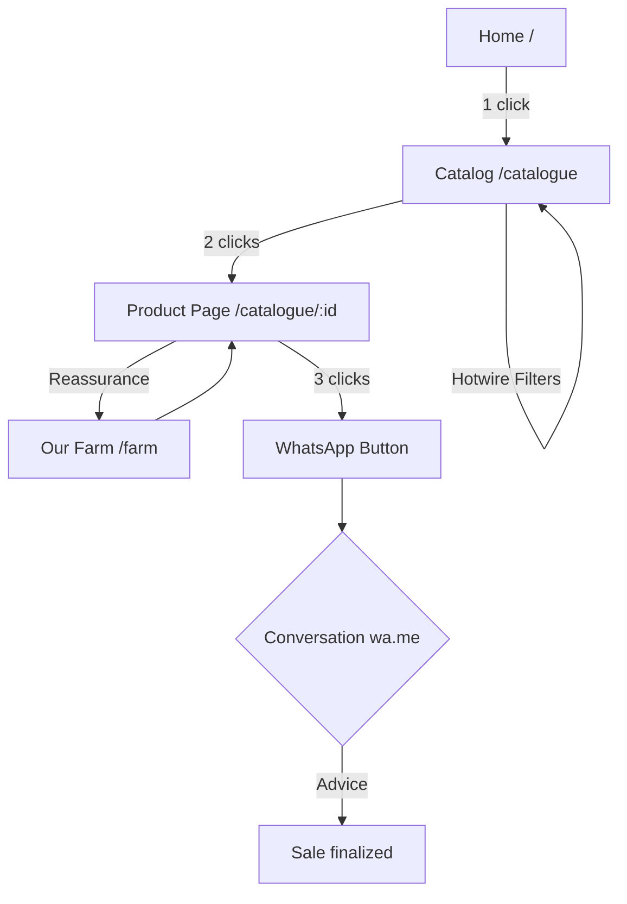

  

  

    
    
    
    
    
  

  

    <i>Digital showcase platform for a koi carp breeding farm affiliated with the Konishi lineage.</i> 
    Final project — <a href="https://www.thehackingproject.org">The Hacking Project</a>
  

---

## About

**Koi's Story** is a digital showcase platform for browsing and ordering koi carp from the Konishi lineage. Visitors can explore the catalog, filter by variety, size or price, and contact the seller directly via WhatsApp in one click.

**Key features**

- Filterable catalog (variety / size / price)
- Product page with photo gallery and Konishi Lineage badge
- Pre-filled "Order via WhatsApp" button
- Photo & video gallery of the breeding farm
- Contact form with email notification
- Admin back-office (koi CRUD, message management)

## Executive Summary

### Presentation
Koi's Story is a premium digital showcase dedicated to the breeding and sale of exceptional koi carp. Led by Mathilde and Emmanuel, this farm stands out for its exclusive affiliation with the prestigious Konishi lineage. The project aims to transform a market traditionally based on word-of-mouth into a modern and immersive digital experience, matching the nobility of these specimens.

### Business Model
The model is based on the sale of high-quality specimens. The platform facilitates conversion by allowing collectors to browse a filterable catalog (variety, size, price) and initiate the purchase through a direct connection via WhatsApp. This channel favors personalized advice and secure transactions for high-value products, bypassing automated payment tunnels.

### Our Clients
Our clients are koi carp enthusiasts, ranging from beginners to seasoned collectors. They seek exclusivity, traceability, and the aesthetic quality guaranteed by the Konishi lineage. This demanding audience prefers mobile consultation and direct contact with the breeder.

### Vision
In 3 years, Koi's Story aims to become the essential digital reference for acquiring Konishi koi carp in France. We aim to consolidate our online presence and continuously optimize the user experience to solidify our position as a leader in this premium niche segment.

## User Journey

### 1. Visitor Journey (Buyer)
The goal is to allow the user to find a fish and contact the seller in **less than 3 clicks**.

*   **Discovery & Home (/)**: Arrival on an immersive landing page.
*   **Catalog Exploration (/catalogue)**: Browsing product cards with dynamic filtering (Hotwire) by variety, size, and price.
*   **Product Detail View (/catalogue/:id)**: Examining HD photos and technical characteristics.
*   **Contact (WhatsApp)**: One-click "Order via WhatsApp" button opening a pre-filled message.

### 2. Administrator Journey (Manager)
*   **Dashboard**: Overview of received messages and stock statistics.
*   **Stock Management (CRUD)**: Adding, updating (available/sold), and deleting koi listings.
*   **Message Management**: Reading and tracking contact requests.

### 3. Journey Visualization

#### Visitor Flow

## Wireframes

### Interactive Prototype
*   [Interactive Wireframes (HTML version)](docs/wireframes.html)

## Project Management
*   **Trello Board**: [Koi's Story Trello](https://trello.com/b/u2kahNMY/kois-story)

## Tech Stack

| Layer          | Technology                         |
| -------------- | ---------------------------------- |
| Back-end       | Ruby on Rails (RESTful, MVC)       |
| Front-end      | Hotwire — Turbo + Stimulus         |
| CSS            | Bootstrap / Tailwind CSS           |
| Database       | SQLite                             |
| Authentication | Devise (roles:`visitor` / `admin`) |
| Linter/Formatter | Biome                             |
| Image upload   | Cloudinary                         |
| Emails         | ActionMailer                       |
| Hosting        | VPS                                |

## Team

Morgan VERHAEGHE · Romain ROYER · Valentin CHÉRON — THP Fullstack cohort
