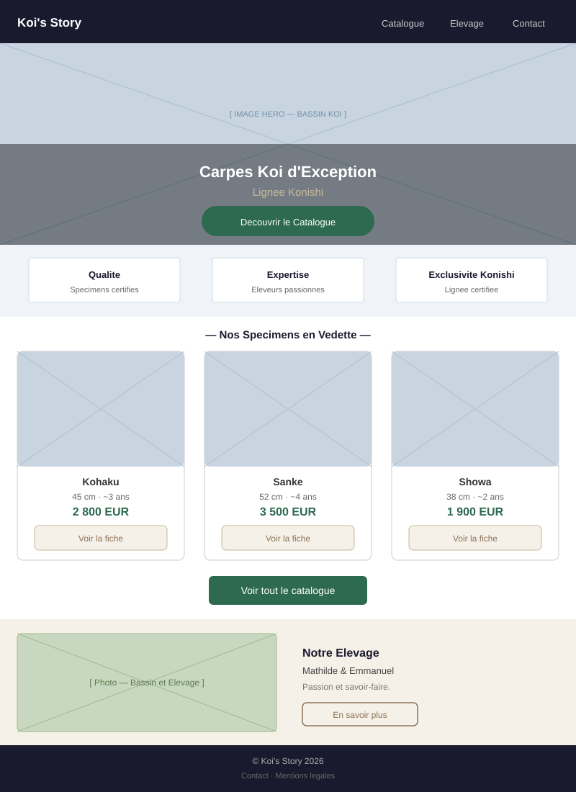
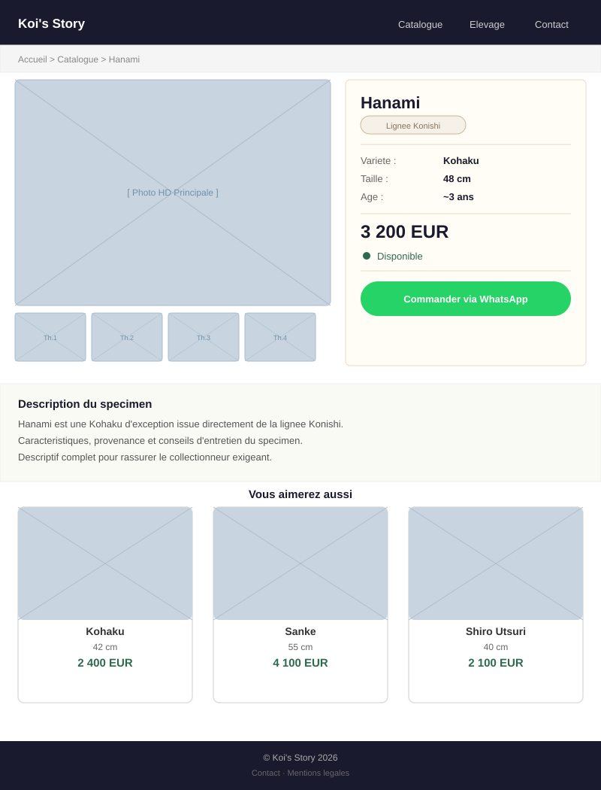

# Wireframes - Koi's Story

Ces wireframes sont des références de conception de **mars 2026**. Ils documentent les intentions initiales de navigation et de structure, mais ne sont pas des captures de l'application actuelle.

La source de vérité actuelle est l'application Rails. En cas d'écart entre ces wireframes et le code Rails, l'application Rails prime.

## Wireframe 1 - Page d'accueil (`/`)

---

## Wireframe 2 - Page Produit (`/catalogue/:id`)

