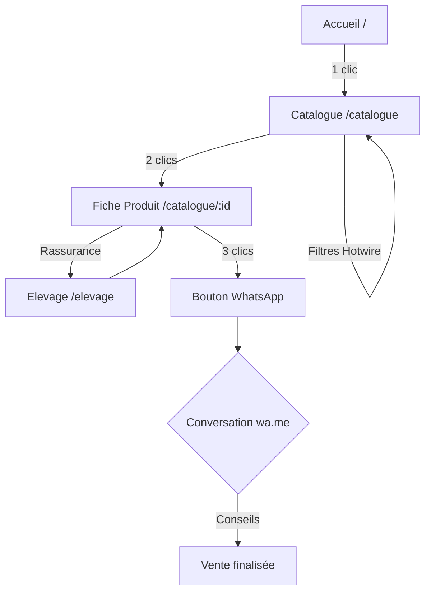
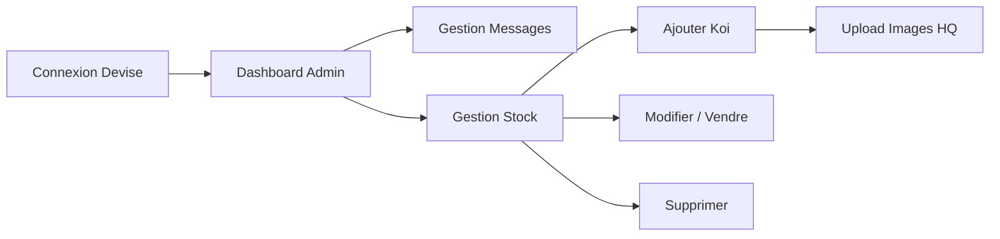

# Parcours utilisateur - Koi's Story

Ce document détaille les étapes clés de l'expérience utilisateur sur la plateforme Koi's Story, en distinguant le parcours des visiteurs (clients potentiels) et celui de l'administrateur (éleveur).

## 1. Parcours Visiteur (Acheteur)

L'objectif est de permettre à l'utilisateur de trouver un poisson et de contacter le vendeur en **moins de 3 clics**.

### Étape 1 : Découverte & Accueil (/)
*   **Entrée** : Arrivée sur une landing page immersive (Hero visuel d'un bassin).
*   **Action** : Lecture de la proposition de valeur (Lignée Konishi, passion, élevage français).
*   **Objectif** : Rassurer sur la qualité et l'expertise dès les premières secondes.

### Étape 2 : Exploration du Catalogue (/catalogue)
*   **Navigation** : Consultation des fiches produits sous forme de "cards" élégantes.
*   **Filtrage** : Utilisation des filtres dynamiques (Hotwire) pour affiner par :
    *   Variété (Kohaku, Sanke, etc.)
    *   Taille (cm)
    *   Prix
*   **Signal de qualité** : Repérage visuel du badge "Lignée Konishi" sur les spécimens concernés.

### Étape 3 : Consultation de la Fiche Produit (/catalogue/:id)
*   **Détails** : Examen des photos haute définition (galerie interactive).
*   **Informations** : Lecture des caractéristiques techniques (taille, âge estimé, description valorisante).
*   **Réassurance** : Consultation optionnelle de la page "Notre Élevage" pour comprendre l'histoire de Mathilde et Emmanuel.

### Étape 4 : Mise en relation (WhatsApp)
*   **Action** : Clic sur le bouton unique "Commander via WhatsApp".
*   **Expérience** : Ouverture automatique de l'application WhatsApp avec un message pré-rempli contenant :
    *   Le nom/référence du koï.
    *   La variété et la taille.
    *   Une demande d'information type.
*   **Finalisation** : La transaction et le conseil se poursuivent en direct avec l'éleveur.

---

## 2. Parcours Administrateur (Gestionnaire)

L'objectif est d'offrir une interface simplifiée pour la gestion quotidienne du stock et des contacts.

### Étape 1 : Authentification (/users/sign_in)
*   Accès sécurisé via Devise pour l'administrateur uniquement.

### Étape 2 : Tableau de bord (Dashboard)
*   Vue d'ensemble sur les messages reçus via le formulaire de contact.
*   Accès rapide aux statistiques de stock (nombre de koï disponibles/vendus).

### Étape 3 : Gestion du Stock (CRUD)
*   **Ajout** : Création d'une nouvelle fiche (nom, variété, prix, taille, badge Konishi).
*   **Média** : Upload simplifié des photos via l'interface (gestion par Cloudinary).
*   **Mise à jour** : Modification rapide du statut (ex: passer de "Disponible" à "Vendu").
*   **Suppression** : Nettoyage du catalogue si nécessaire.

### Étape 4 : Gestion des Messages
*   Lecture et marquage des messages de contact reçus par email/formulaire.
*   Suivi des demandes générales des clients.

## 3. Visualisation des parcours (Mermaid)

### Parcours Visiteur

### Parcours Administrateur

---

## Points de vigilance UX (Mobile-First)
*   **Rapidité** : Temps de chargement optimisé pour les photos HD (WebP, lazy loading).
*   **Accessibilité** : Boutons de contact larges et visibles sur smartphone.
*   **Clarté** : Pas de jargon technique imposé aux débutants dès l'accueil, mais précision technique disponible pour les experts.
