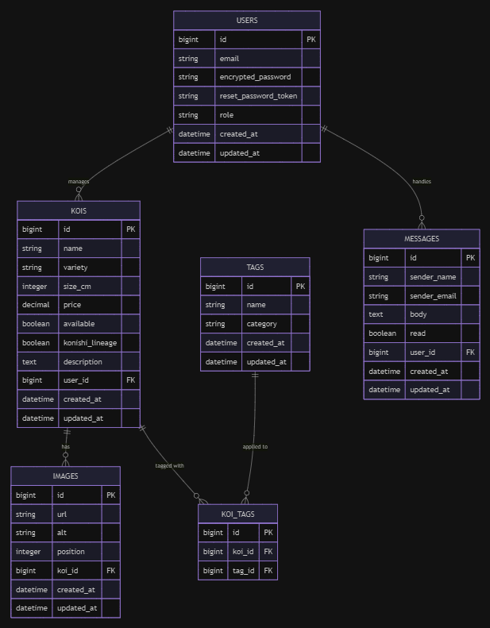

## 1. Présentation
Le marché des carpes Koï d’exception repose encore largement sur le bouche-à-oreille et des annonces peu valorisantes, ne reflétant pas la noblesse de ces spécimens. Koi's Story répond au besoin de Mathilde et Emmanuel, éleveurs passionnés, d'avoir une vitrine digitale à la hauteur de leur savoir-faire et de leur affiliation à la prestigieuse lignée Konishi en France.

Koi's Story est une vitrine digitale interactive conçue en mobile-first pour une expérience immersive. Elle permet aux collectionneurs de parcourir un catalogue premium, de filtrer les spécimens par variété, taille ou prix, et d'initier l'acquisition via une mise en relation directe par WhatsApp. C’est l’alliance de l’élégance visuelle et de la fluidité opérationnelle pour un segment de niche exigeant.

## 2. Parcours utilisateur
L'utilisateur arrive sur une landing page épurée mettant en avant l'exclusivité de la lignée Konishi. Il accède ensuite au catalogue où il peut filtrer les carpes de manière fluide. En cliquant sur une carte, il découvre une fiche détaillée riche : photos HD, caractéristiques précises (variété, taille, âge) et badge d'authenticité.

S'il est intéressé, un bouton unique "Commander via WhatsApp" ouvre une conversation pré-remplie avec l'éleveur contenant les détails du poisson (Nom, ID, Prix). Côté administration, l'éleveur dispose d'un dashboard sécurisé pour gérer son stock en temps réel (CRUD complet), uploader des médias et traiter les demandes de contact classiques.

## 3. Concrètement et techniquement

### 3.1. Base de données
Nous utilisons SQLite pour sa simplicité et sa légèreté. Le schéma est structuré conformément à notre ERD autour de six tables clés :
- **USERS** : Gérés via Devise avec des rôles (admin/visitor). Un administrateur gère le stock et traite les messages.
- **KOIS** : La table maîtresse contenant les attributs spécifiques (`name`, `variety`, `size_cm`, `price`, `available`, `konishi_lineage`, `description`).
- **IMAGES** : Chaque carpe possède plusieurs visuels avec gestion de l'ordre d'affichage (`position`) pour des galeries HD optimisées.
- **TAGS** & **KOI_TAGS** : Système de classification par attributs et catégories via une relation N-N (`has_many :through`) pour un filtrage multicritères.
- **MESSAGES** : Gestion des formulaires de contact (`sender_name`, `sender_email`, `body`, `read`) rattachés à l'utilisateur administrateur.

 

 

### 3.2. Front
Le front est propulsé par Hotwire (Turbo + Stimulus) pour offrir une réactivité proche d'une SPA sans la complexité du JavaScript lourd. Nous utilisons Tailwind CSS pour un design "Luxe & Nature" totalement responsive. Des composants Stimulus spécifiques géreront les filtres dynamiques du catalogue et les galeries photos interactives (zoom et carrousels).

### 3.3. Backend
Le projet repose sur Ruby on Rails 7. Nous intégrons Active Storage combiné à Cloudinary pour l'hébergement et l'optimisation dynamique des visuels haute résolution. ActionMailer gérera les notifications automatiques, tandis que l'intégration de l'API wa.me (WhatsApp) permettra de générer des liens de commande contextuels sans tunnel de paiement complexe.

### 3.4. Mes besoins techniques
Notre équipe (Morgan, Romain, Valentin) maîtrise les fondamentaux de Ruby on Rails ainsi que l'intégration Tailwind CSS. Nous sommes autonomes sur l'ensemble de la stack technique mentionnée et notre équipe est déjà complète, nous n'avons donc pas de besoins de recrutement supplémentaires pour ce projet.

## 4. La version minimaliste mais fonctionnelle qu'il faut avoir livré la première semaine
Notre MVP se concentre sur le cycle "Donnée -> Affichage -> Contact" :
1. Déploiement d'une base SQLite avec les tables USERS et KOIS.
2. Catalogue fonctionnel affichant la liste des carpes Koï disponibles.
3. Fiche produit individuelle accessible affichant les caractéristiques de base.
4. Bouton WhatsApp opérationnel (lien vers le numéro du vendeur avec message simple).
5. Interface Admin sécurisée permettant l'ajout et la suppression de poissons.

## 5. La version que l'on présentera aux jury
Pour la version finale, nous enrichirons l'expérience utilisateur avec :
* **Filtres dynamiques** : Recherche en temps réel sans rechargement de page via Turbo Frames.
* **Gestion média avancée** : Galeries multi-images avec gestion des positions et zoom.
* **Système de Tags** : Classification complète permettant une recherche granulaire.
* **Dashboard Admin** : Suivi de l'état du stock et lecture centralisée des messages.
* **Polissage UI** : Animations fluides et respect strict de la charte graphique Konishi.

## 6. Notre mentor
à compléter
